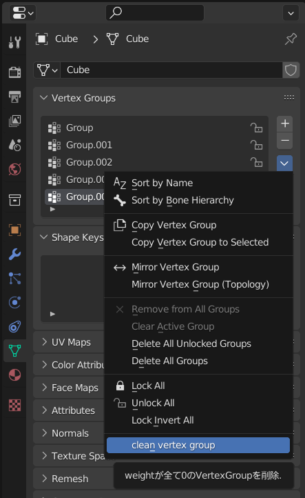

blender3.1以降にて、空の(weightが0な)vertex groupを削除できるようになるaddonです。

# 使い方
addonsとしてインストールし、有効化。

空のVertex Groupを削除したオブジェクトを選択。
Object Data PropertiesのVertex Groupsから右の&#x2C5;を押して、
`clean vertex group`を実行。

